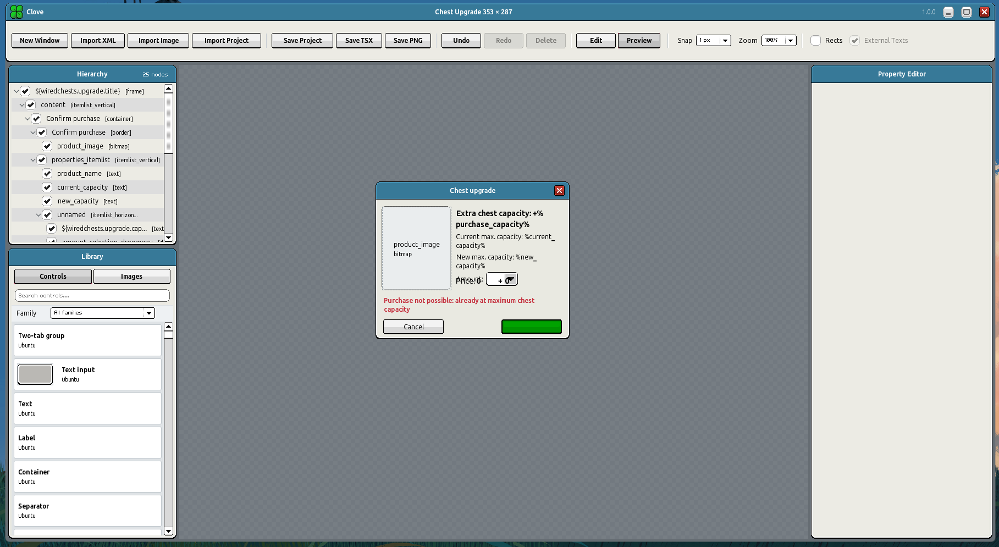
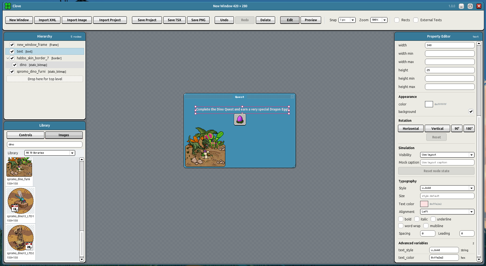
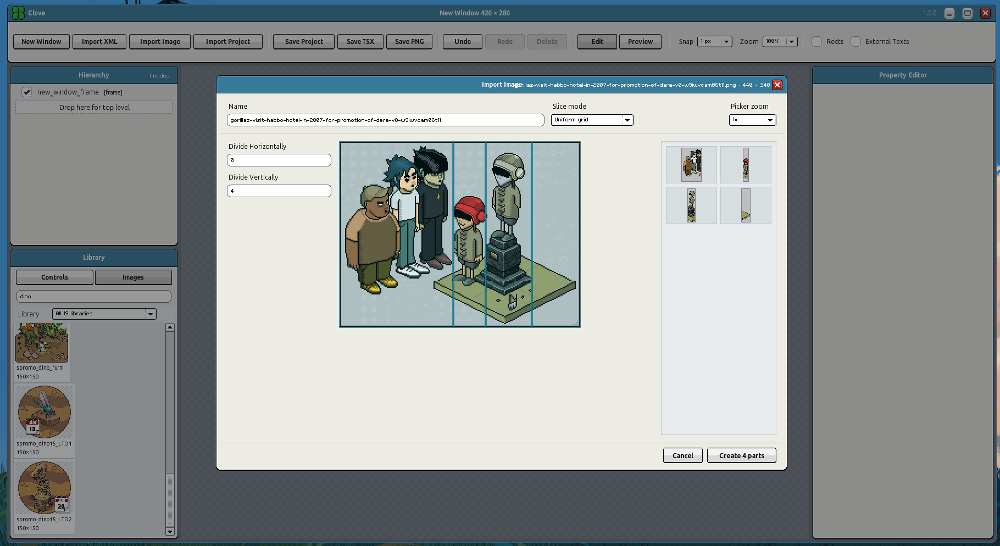

# Clove

Clove is an open-source desktop editor for building Habbo UI layouts for Nitro clients. It imports Habbo layout XML, renders controls locally, and exports editable TSX components or reusable `.clove.json` projects.

## Download

Download the latest Windows `.exe` or macOS `.dmg` from [GitHub Releases](https://github.com/iSetht/Clove/releases/latest).

The source archives are for developers and are not installers.

## Showcase

| Edit imported layouts | Build with library assets | Slice custom images |
|:---:|:---:|:---:|
| [](Chest.png) | [](Dino.png) | [](Import.png) |

## Features

- Import `.xml` and `.bin` Habbo window layouts.
- Build layouts with a drag-and-drop control and image library.
- Edit hierarchy, geometry, captions, styles, variables, visibility, and preview states.
- Import custom image sheets and define reusable regions or button states.
- Save projects as `.clove.json`.
- Export typed TSX, a slot guide, and referenced custom images.
- Capture the current window as a PNG.
- Render Volter and other Habbo fonts with [Truffle Text](https://github.com/iSetht/truffle-text).

## Development

Cloning the repository is intended for people who want to inspect, modify, or build on Clove. Everyone else should use the packaged app from GitHub Releases.

Requirements:

- Node.js 22 or newer
- Corepack and Yarn 4

```powershell
corepack enable
yarn install --immutable
yarn assets
yarn dev
```

Run `yarn test`, `yarn typecheck`, and `yarn build:renderer` to validate changes.

## License

Original Clove source code is available under the [MIT License](LICENSE).

Habbo names, graphics, game data, and other third-party material are not licensed under MIT. See [THIRD_PARTY_NOTICES.md](THIRD_PARTY_NOTICES.md).

> This project is not affiliated with, endorsed, sponsored, or specifically approved by Sulake Oy or its Affiliates.
